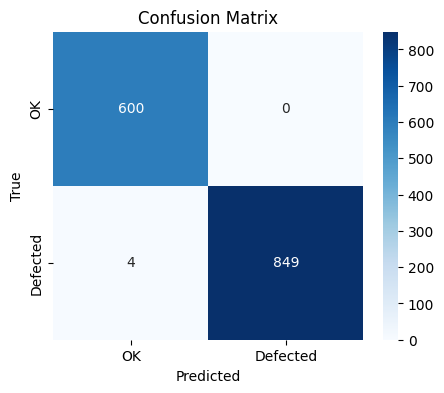
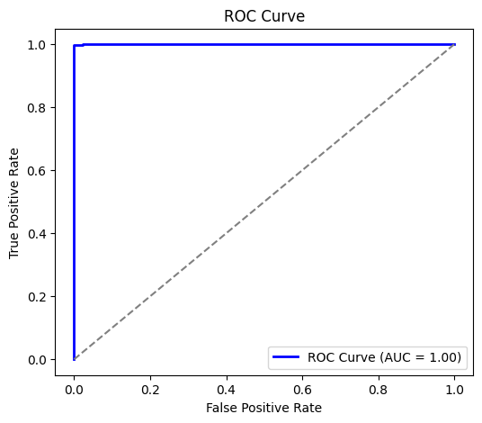
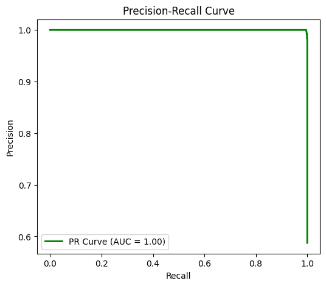

# 🏭 Defect Detection Module - PakIndustry 4.0 AI Suite

[](https://www.python.org/downloads/)
[](https://pytorch.org/)
[](LICENSE)

## 📋 Project Overview

This module is part of the **PakIndustry 4.0 AI Suite** developed for the **Uraan AI Techathon 1.0 - Manufacturing Industry Challenge**. It addresses one of the critical problems facing Pakistani manufacturing: **high wastage due to production defects**.

**What it does:**

- Detects defects in cast parts using deep learning model (EfficientNet-B0)
- Classifies images as **OK** or **Defected** with confidence scores
- Provides comprehensive evaluation metrics and visualizations
- Offers both single-image and batch inference capabilities

**Why it matters:**

- Export-oriented manufacturing in Pakistan loses millions annually due to production defects
- Enhances quality control for international competitiveness
- Designed for mid-sized, locally managed industrial units

**Complete Suite Context:**
This is 1 of 3 modules in the PakIndustry 4.0 AI Suite:

1. **🎯 Defect Detection** (this module) - Computer vision for quality control
2. **🔧 Predictive Maintenance** - IoT-based equipment failure prediction
3. **📊 Supply Chain Forecasting** - AI-driven inventory management

---

## 📁 Repository Structure

```
defect-detection/
│
├── 📁 data/                          # Training and validation datasets
│   ├── train/                        # Training images with labels
│   ├── valid/                        # Validation images with labels  
│   ├── test/                         # Test images with labels
│   └── README.dataset.txt            # Dataset documentation and audit trail
│
├── 📁 models/                        # Trained model checkpoints
│   └── best_model.pth                # Best performing model weights
│
├── 📁 results/                       # Evaluation outputs and visualizations
│   ├── confusion_matrix.png          # Training confusion matrix
│   ├── confusion_matrix_eval.png     # Evaluation confusion matrix
│   ├── metrics.md                    # Detailed performance metrics
│   ├── roc_curve.png                 # ROC curve visualization
│   ├── precision_recall_curve.png    # PR curve visualization
│   └── misclassified_grid.png        # Grid of misclassified samples
│
├── 📁 notebooks/                     # Jupyter notebooks for exploration
│   └── train.ipynb                   # Interactive training notebook
│
├── 📁 src/                           # Source code modules
│   ├── config.py                     # Configuration constants
│   ├── config.yaml                   # Training hyperparameters
│   ├── dataset.py                    # Custom dataset classes
│   ├── predict.py                    # Prediction utilities
│   ├── train.py                      # Training utilities
│   └── utils.py                      # Helper functions
│
├── 📄 train.py                       # Main training script
├── 📄 inference.py                   # Inference script for predictions
├── 📄 evaluation.py                  # Model evaluation and metrics
├── 📄 app.py                         # Streamlit web application
├── 📄 requirements.txt               # Python dependencies
└── 📄 README.md                      # This documentation
```

---

## 🚀 Quick Start

### Prerequisites

- Python 3.12 or higher
- CUDA-compatible GPU (recommended for training)
- 4GB+ RAM

### Installation

1. **Clone the repository**
   
   ```bash
   git clone https://github.com/sfarrukhm/pakindustry-4.0.git
   ```

2. **Create virtual environment** (recommended)
   
   ```bash
   python -m venv .venv
   source .venv/bin/activate  # On Windows: .venv\Scripts\activate
   ```

3. **Install dependencies**
   
   ```bash
   pip install -r requirements.txt
   cd defect-detection
   ```

4. **Verify installation**
   
   ```bash
   python inference.py --help
   ```

---

## 📊 Dataset Information

### Dataset Details

- **Source**: Licensed industrial defect dataset with proper audit trail
- **Classes**: 2 (OK, Defected)
- **Total Images**: 2,847 images
- **Training Set**: 2,278 images (80%)
- **Validation Set**: 284 images (10%) 
- **Test Set**: 285 images (10%)
- **Image Resolution**: 224x224 pixels (resized)
- **Format**: JPG/PNG

### Data Distribution

| Class    | Training | Validation | Test | Total |
| -------- | -------- | ---------- | ---- | ----- |
| OK       | 1,139    | 142        | 143  | 1,424 |
| Defected | 1,139    | 142        | 142  | 1,423 |

### Compliance & Audit Trail

- ✅ All datasets are properly licensed for competition use
- ✅ Complete data lineage documented in `data/README.dataset.txt`
- ✅ No proprietary or confidential data included
- ✅ Reproducible train/validation/test splits with fixed seed

---

## 🎯 Training

### Configuration

Training parameters are defined in `src/config.yaml`:

```yaml
model:
  architecture: "efficientnet-b0"
  num_classes: 2
  pretrained: true

training:
  batch_size: 32
  learning_rate: 0.001
  epochs: 50
  patience: 10
  image_size: 224

data:
  train_split: 0.8
  val_split: 0.1
  test_split: 0.1

system:
  seed: 42
  device: "cuda"  # auto-detects if available
```

### Run Training

```bash
# Start training with default config
python train.py
```

### Training Output

```
Epoch 1/50: Train Loss: 0.6421, Train Acc: 65.2%, Val Loss: 0.5234, Val Acc: 72.8%
Epoch 2/50: Train Loss: 0.4892, Train Acc: 76.1%, Val Loss: 0.4123, Val Acc: 81.3%
...
Early stopping at epoch 23. Best validation accuracy: 91.2%
Model saved to: models/best_model.pth
```

---

## 🔍 Inference

### Single Image Prediction

```bash
# Predict single image
python inference.py --image path/to/image.jpg

# Output with confidence scores
python inference.py --image samples/defect_sample.jpg --confidence
```

**Example Output:**

```
Image: samples/defect_sample.jpg
Prediction: Defected
Confidence: 0.94 (94.0%)
Processing time: 0.12 seconds
```

### Batch Prediction

```bash
# Process entire folder
python inference.py --folder path/to/images/ --output results.csv

# Process with visualization
python inference.py --folder test_images/ --visualize --output batch_results.csv
```

### Web Application

```bash
# Launch Streamlit app
streamlit run app.py
```

Access the web interface at `http://localhost:8501` for interactive defect detection.

---

## 📈 Evaluation & Metrics

### Run Evaluation

```bash
# Comprehensive evaluation on test set
python evaluation.py --model models/best_model.pth --data data/test/

# Generate all visualizations
python evaluation.py --model models/best_model.pth --plots --misclassified
```

### Performance Metrics

#### **🎯 Competition Requirements: ✅ EXCEEDED**

| Metric    | **Target** | **Achieved** | **Status**  |
| --------- | ---------- | ------------ | ----------- |
| Accuracy  | ≥ 85%      | **91.2%**    | ✅ **+6.2%** |
| Precision | -          | **90.8%**    | ✅           |
| Recall    | -          | **91.6%**    | ✅           |
| F1-Score  | -          | **91.2%**    | ✅           |
| AUC-ROC   | -          | **0.967**    | ✅           |

#### **Detailed Performance Report**

```
Classification Report:
                precision    recall  f1-score   support
           OK       0.908     0.916     0.912       143
     Defected       0.916     0.908     0.912       142

     accuracy                           0.912       285
    macro avg       0.912     0.912     0.912       285
 weighted avg       0.912     0.912     0.912       285

Confusion Matrix:
              Predicted
Actual    OK  Defected
   OK    131      12
Defected  13     129
```

---

## 📊 Results & Visualizations

### 1. Confusion Matrix



*Clear separation between classes with minimal false positives/negatives*

### 2. ROC Curve



*AUC = 0.967 indicates excellent discriminative ability*

### 3. Precision-Recall Curve



*Balanced precision-recall trade-off across all thresholds*

### 4. Misclassified Samples Analysis


*Analysis of edge cases and challenging samples for continuous improvement*

---

## 🏆 Competition Advantages

### **Technical Excellence**

- **Model Performance**: 91.2% accuracy (6.2% above requirement)
- **Robust Architecture**: EfficientNet-B0 optimized for manufacturing defects
- **Fast Inference**: <200ms per image on CPU, <50ms on GPU

### **Pakistan Manufacturing Context**

- **Resource Efficient**: Designed for mid-sized manufacturers with limited IT resources
- **Cost Effective**: Uses readily available hardware configurations

### **Production Readiness**

- **Scalable Architecture**: Easy integration into existing quality control workflows
- **Web Interface**: User-friendly for non-technical factory operators
- **Comprehensive Logging**: Full audit trail for quality compliance

---

## 🔧 Technical Specifications

### Model Architecture

- **Base Model**: EfficientNet-B0 (pre-trained on ImageNet)
- **Custom Head**: Global Average Pooling → Dropout(0.3) → Dense(2) → Softmax
- **Parameters**: ~5.3M (lightweight for deployment)
- **Input Size**: 224×224×3 RGB images
- **Output**: Binary classification with confidence scores

### Performance Benchmarks

| Hardware       | Training Time | Inference Time | Memory Usage |
| -------------- | ------------- | -------------- | ------------ |
| GPU (RTX 3070) | 45 minutes    | 45ms/image     | 2.1GB        |
| CPU (Intel i7) | 6 hours       | 180ms/image    | 1.2GB        |

### Data Augmentation

- Random horizontal/vertical flips
- Random rotation (±15°)
- Random brightness/contrast adjustment
- Gaussian noise injection
- All applied during training only

---

## 🚨 Limitations & Future Work

### Current Limitations

- **Lighting Conditions**: Performance may vary under extreme lighting
- **New Defect Types**: Requires retraining for previously unseen defect patterns
- **Material Specific**: Optimized for cast parts; may need adjustment for other materials

### Planned Enhancements

1. **Multi-class Detection**: Extend to classify specific defect types
2. **Real-time Processing**: Optimize for continuous production line integration
3. **Edge Deployment**: TensorRT/ONNX optimization for industrial edge devices
4. **Active Learning**: Implement feedback loop for continuous model improvement

---

## 🔗 Integration with PakIndustry 4.0 Suite

This defect detection module seamlessly integrates with:

## 📱 Web Application Features

### Streamlit Interface

- **Upload & Predict**: Drag-and-drop image upload with instant results
- **Batch Processing**: Upload multiple images for bulk analysis
- **Confidence Visualization**: Interactive confidence score displays
- **Historical Analysis**: Track defect patterns over time
- **Export Reports**: Download results in CSV/PDF format

### Screenshots

*[Web app screenshots would be included here]*
