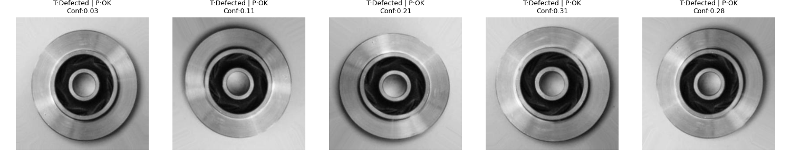

# 📊 Defect Detection Evaluation Report

## ✅ Metrics
- Accuracy: **0.9966**
- Precision: **1.0000**
- Recall: **0.9941**
- F1-score: **0.9971**
- ROC-AUC: **1.0000**
- Evaluation Time: **14.49 sec**

## 🧮 Confusion Matrix
```
              Predicted OK | Predicted Defected
----------------------------------------
Actual OK              600 |                 0
Actual Defected          5 |               849
```


## 📈 Curves
- [ROC Curve](roc_curve.png)
- [Precision-Recall Curve](precision_recall_curve.png)

## 🔍 Misclassified Samples
- Total Misclassified: **5**
- [CSV with details](misclassified_samples.csv)
- Example grid plot:



## 📂 Data Exports
- [Metrics CSV](metrics.csv)
- [All Predictions CSV](all_predictions.csv)
